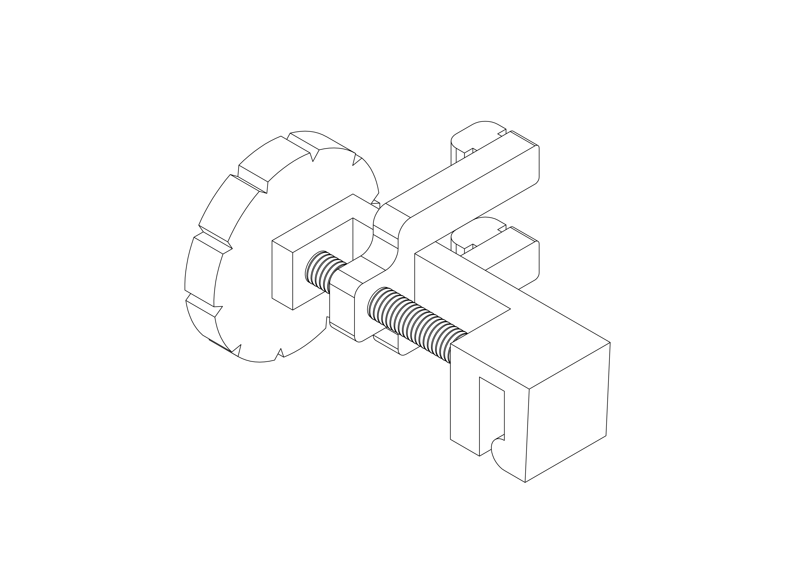

# spec-shield

spec-shield is a curvature adjustable face shield that tackles undesirable reflections and can be mounted on spectacles. 

# Design space exploration
The curvature of the face shield is modelled as a parabola with a fixed arc length between the mounting points.

The entire design space is explored for curves that prevent undesirable reflections and optimal design variables are chosen.

# Preliminary design

## Design variables:
* Width of frame, fw = 67.5mm
* Mounting offset, fh = 20mm
* Mounting point (x), mx = 10mm to 30mm
* Mounting point (y), my = 15mm
  

# 3D Printed components

## Parameters:
* Layer height = 0.12mm
* Nozzle diameter = 0.4mm
* Infill = 100%

G-codes can be found here: [gcodes](gcode)

# spec-shield

This is merely a working prototype and contributions are welcome.
